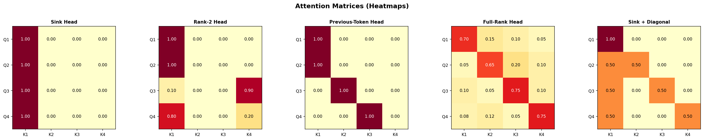
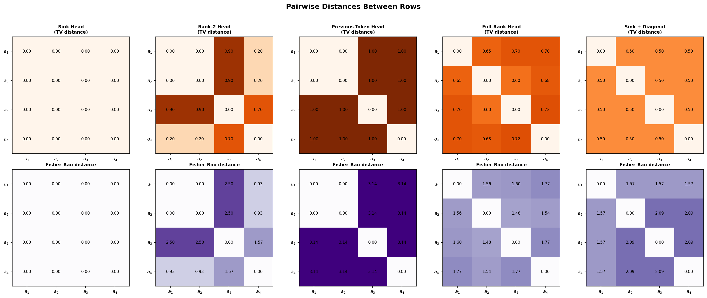

# Seeing Attention Through the Simplex: A Geometric Lens on Transformer Heads

## Introduction

From language models to vision systems, transformers have took the scene as a all-in-one architechtures, and at their core lies the **attention mechanism**. We often visualize attention as heatmaps: grids of numbers showing how much each token "looks at" every other token. But these heatmaps, while useful, hide a rich geometric structure.

What if we could *see* attention patterns as shapes? As points, lines, and volumes inside a well-known geometric object?

It turns out we can. Each row of an attention matrix is a probability distribution, and probability distributions live on a beautiful geometric object called a **simplex**. By plotting attention rows on the simplex, we can literally see the difference between a "sink head" (all tokens staring at one place), a "copying head" (each token looking at its predecessor), and a "mixing head" (attention spread across everything).

Of course, there is a catch: this visualization only works in low dimensions — up to $4 \times 4$ attention matrices, which map onto a tetrahedron we can plot in 3D. Real transformers operate in much higher dimensions. But even in this toy setting, the geometric view offers **intuitions that transfer**: rank constraints become visible as dimensional collapses, diversity becomes volume, and selectivity becomes proximity to vertices.

Let us take this walk from definitions to pictures.

---

## Step 1: Simplices and Attention

### The Simplex

An **$(n{-}1)$-simplex** $\Delta^{n-1}$ is the set of all probability distributions over $n$ outcomes:

$$\Delta^{n-1} = \left\{ (p_1, \ldots, p_n) \in \mathbb{R}^n \;\middle|\; p_i \geq 0, \;\sum_{i=1}^n p_i = 1 \right\}$$

For small $n$:
- $n = 2$: a line segment (between "all on token 1" and "all on token 2")
- $n = 3$: a triangle (the 2-simplex)
- $n = 4$: a tetrahedron (the 3-simplex).

The **vertices** of the simplex are the "pure" distributions: $e_1 = (1, 0, 0, 0)$, $e_2 = (0, 1, 0, 0)$, etc. The **center** $(1/n, \ldots, 1/n)$ is the uniform distribution.

### Attention

In a transformer, given queries $Q$, keys $K$, and values $V$, the attention mechanism computes:

$$A = \text{softmax}\!\left(\frac{QK^\top}{\sqrt{d_k}}\right)$$

The result $A$ is an $n \times n$ **row-stochastic matrix**: every row sums to 1, every entry is non-negative. Each row $a_i$ tells us how token $i$ distributes its attention over all $n$ tokens.

Each row $a_i$ is therefore a point on the $(n{-}1)$-simplex $\Delta^{n-1}$.

---

## Step 2: Why Attention Lives on the Simplex

This is the key insight: **an $n \times n$ attention matrix $A$ places $n$ points on the $(n{-}1)$-simplex.** Row $i$ of $A$ is the point in $\Delta^{n-1}$ representing the attention distribution of token $i$.

The **convex hull** of these $n$ points, the smallest convex shape containing them. is what we call the **row polytope** of $A$. The geometry of this polytope encodes properties of the attention pattern:

| Geometric property | Attention interpretation |
|---|---|
| Points clustered together | Rows are similar — tokens attend similarly (low diversity) |
| Points near vertices | Rows are peaked — tokens attend selectively (high selectivity) |
| Points near the center | Rows are diffuse — attention is spread out (high entropy) |
| Polytope has large volume | Rows are diverse — different tokens attend very differently |
| Polytope is flat (low-dimensional) | The matrix has low rank — a few "prototypes" generate all rows |

The **rank** of the attention matrix constrains the dimension of the polytope:
- **Rank 1**: all rows are identical → the polytope is a single **point**
- **Rank 2**: rows lie on a **line** within the simplex
- **Rank 3**: rows lie on a **plane** (a 2D surface within the simplex)
- **Rank $n$**: rows can span the full simplex — the polytope is a genuine **$(n{-}1)$-dimensional** solid

In general, the row polytope lives in a $(r{-}1)$-dimensional affine subspace, where $r = \text{rank}(A)$. This is because rank-$r$ means the rows live in an $r$-dimensional linear subspace, and intersecting that with the simplex (the constraint $\sum a_i = 1$) removes one degree of freedom.

---

## Step 3: Five Archetypes on the 3-Simplex

We now consider $4 \times 4$ attention matrices, the sweet spot where we can still visualize things in 3D (the 3-simplex is a tetrahedron). We pick five archetypal patterns that appear in real transformer heads:

### 1. The Sink Head

$$A_{\text{sink}} = \begin{pmatrix} 1 & 0 & 0 & 0 \\ 1 & 0 & 0 & 0 \\ 1 & 0 & 0 & 0 \\ 1 & 0 & 0 & 0 \end{pmatrix}$$

Every token sends all its attention to token 1 (the "sink" or "BOS" token). All four rows are the same point: the vertex $e_1$. The polytope is a single point. Rank = 1.

This is the degenerate extreme: maximum selectivity, zero diversity. In practice, some attention heads in language models do exactly this: they learn to "park" attention on a designated token when there is nothing useful to attend to. These are sometimes called **attention sinks** or **null heads**.

### 2. The Rank-2 Head

$$A_{\text{rank2}} = \begin{pmatrix} 1 & 0 & 0 & 0 \\ 1 & 0 & 0 & 0 \\ 0.1 & 0 & 0 & 0.9 \\ 0.8 & 0 & 0 & 0.2 \end{pmatrix}$$

All rows live in the span of $e_1$ and $e_4$ — columns 2 and 3 are identically zero. The polytope is a **line segment** along the edge connecting $e_1$ to $e_4$. Rank = 2.

This is the simplest non-trivial case: the head can only mix between two "prototype" attention targets (token 1 and token 4). Two rows are pinned at $e_1$, while the others slide along the $e_1$–$e_4$ edge. On the simplex, all rows are collinear — the row polytope is one-dimensional.

Rank-2 attention arises when the query-key interaction effectively reduces to a single discriminating direction. It is a common regime in early layers or in heads that specialize in binary decisions (attend to this token or that one).

### 3. The Previous-Token Head

$$A_{\text{prev}} = \begin{pmatrix} 1 & 0 & 0 & 0 \\ 1 & 0 & 0 & 0 \\ 0 & 1 & 0 & 0 \\ 0 & 0 & 1 & 0 \end{pmatrix}$$

Each token attends to the token before it (with the first token attending to itself, and assuming a causal mask). The rows are $e_1, e_1, e_2, e_3$ — three distinct vertices of the tetrahedron. The polytope is a **triangle** (a 2D face of the tetrahedron). Rank = 3.

This pattern implements a **shift operation**: the output at position $i$ copies the value from position $i{-}1$. It is highly selective (each row is a vertex = a delta distribution) and highly diverse (rows point in completely different directions). Previous-token heads are among the most commonly identified "induction" circuit components.

### 4. The Full-Rank Head

$$A_{\text{full}} = \begin{pmatrix} 0.70 & 0.10 & 0.10 & 0.10 \\ 0.10 & 0.70 & 0.10 & 0.10 \\ 0.10 & 0.10 & 0.70 & 0.10 \\ 0.10 & 0.10 & 0.10 & 0.70 \end{pmatrix}$$

Each token mostly attends to itself, with some residual attention spread uniformly. The four rows form a **tetrahedron** inside the simplex: the polytope is a scaled-down copy of the full simplex, centered but shifted toward the vertices. Rank = 4 (full rank, generically as we perturb from identity). Actually this specific matrix has rank 2 since $A = 0.1 \cdot \mathbf{1}\mathbf{1}^\top + 0.6 \cdot I$ but let us use a less symmetric version:

$$A_{\text{full}} = \begin{pmatrix} 0.70 & 0.15 & 0.10 & 0.05 \\ 0.05 & 0.65 & 0.20 & 0.10 \\ 0.10 & 0.05 & 0.75 & 0.10 \\ 0.08 & 0.12 & 0.05 & 0.75 \end{pmatrix}$$

Now the rows genuinely span a 3D region inside the tetrahedron — the polytope has **volume**. This represents an attention head with maximum expressive freedom: every token has a distinct, non-degenerate attention pattern.

### 5. The Sink + Diagonal Head

$$A_{\text{sink+diag}} = \begin{pmatrix} 1 & 0 & 0 & 0 \\ 0.50 & 0.50 & 0 & 0 \\ 0.50 & 0 & 0.50 & 0 \\ 0.50 & 0 & 0 & 0.50 \end{pmatrix}$$

Token 1 is a pure sink. Tokens 2–4 split their attention between the sink and themselves. The rows form a pattern: $e_1$ is at a vertex, and the other three rows are midpoints of edges emanating from $e_1$. The polytope is a **triangle** (2D), but it is "anchored" at the sink vertex.

This is a common pattern in early layers of transformers: a combination of positional (self-attention on the diagonal) and a learned bias toward a sink token. It has rank 4 (each row is distinct), but its geometry is constrained — the polytope is flat because rows 2–4 are all convex combinations of $e_1$ and one vertex.

### Seeing All Five on the Simplex

The interactive 3D visualizations below (generated with Plotly — drag to rotate, scroll to zoom, hover for details) show each polytope inside the tetrahedron:

<iframe src="figures/simplex_all_polytopes.html" width="100%" height="450" frameborder="0" style="border:none;"></iframe>

Explore each archetype individually:

<iframe src="figures/simplex_sink_head.html" width="48%" height="400" frameborder="0" style="border:1px solid #eee;"></iframe>
<iframe src="figures/simplex_rank2_head.html" width="48%" height="400" frameborder="0" style="border:1px solid #eee;"></iframe>
<iframe src="figures/simplex_previoustoken_head.html" width="48%" height="400" frameborder="0" style="border:1px solid #eee;"></iframe>
<iframe src="figures/simplex_fullrank_head.html" width="48%" height="400" frameborder="0" style="border:1px solid #eee;"></iframe>
<iframe src="figures/simplex_sink_plus_diagonal.html" width="48%" height="400" frameborder="0" style="border:1px solid #eee;"></iframe>

---

## Polytopes and Geometric Quantities

Once we see attention as polytopes on the simplex, we can **measure** their geometry:

### Volume (or Area, or Length)

The $(r{-}1)$-dimensional volume of the row polytope quantifies **diversity**: how different are the attention patterns of different tokens?

- **Volume = 0**: all rows are identical (rank 1) or collinear (rank 2 with zero length only if degenerate)
- **Small volume**: rows are similar — the head computes similar functions for all tokens
- **Large volume**: rows are diverse — the head differentiates strongly between tokens

### Distance to Vertices

The average distance of the rows to the nearest vertex measures **selectivity**:

- **Close to vertices**: peaked distributions (low entropy, sharp attention)
- **Close to center**: diffuse distributions (high entropy, spread attention)

### Centroid Position

Where the centroid (average row) falls in the simplex tells us about **bias**: does the head, on average, favor certain tokens?

---

## Step 4: Connections to Information Geometry

The simplex is not just a flat triangular surface — it carries a natural **curved geometry** given by information theory.

### The Fisher-Rao Metric

The Fisher-Rao metric endows the simplex with a Riemannian structure where the distance between two distributions $p, q \in \Delta^{n-1}$ is:

$$d_{FR}(p, q) = 2 \arccos\!\left(\sum_{i=1}^n \sqrt{p_i \, q_i}\right)$$

This is the geodesic distance on the "statistical manifold." Under this metric, the simplex is (a piece of) a sphere: the map $p \mapsto 2\sqrt{p}$ sends the simplex to the positive orthant of the unit sphere.

What does this mean for attention? The Fisher-Rao distance between two rows of the attention matrix measures how "informationally different" the two attention patterns are — not in the flat Euclidean sense, but in a way that respects the probabilistic nature of the distributions.

Near the vertices (peaked distributions), the Fisher-Rao metric "stretches" — small changes in attention weights correspond to large informational differences. Near the center (uniform distribution), the metric "compresses" — the same numerical change matters less. This is exactly the right notion: changing attention from 0.01 to 0.02 (doubling!) is more significant than changing from 0.50 to 0.51.

### Uncertainty and Entropy

The entropy of a row $H(a_i) = -\sum_j a_{ij} \log a_{ij}$ measures **uncertainty** — how uncertain is token $i$ about where to attend?

On the simplex, entropy defines a "height function": the center has maximum entropy ($\log n$), and the vertices have minimum entropy (0). Lines of constant entropy are "level sets" — curves on the simplex where all distributions have the same uncertainty.

There is a beautiful **uncertainty principle** at play: a row cannot be simultaneously close to two different vertices. If $a_i$ is close to $e_j$ (high attention on token $j$), it must be far from all other vertices. The simplex geometry enforces this tradeoff between attending to one thing vs. spreading attention.

### From Fisher-Rao to Attention Analysis

These connections suggest a program:
1. **Measure attention diversity** using Fisher-Rao distances rather than Euclidean distances — this gives informationally meaningful comparisons
2. **Study the curvature** of attention trajectories across layers — how does the distribution of attention patterns evolve on the statistical manifold?
3. **Connect rank to curvature**: low-rank attention restricts rows to a flat submanifold of the simplex, while full-rank attention can explore curved regions

---

## Conclusion

Visualizing attention on the simplex is a simple idea with surprising depth. By treating each row of the attention matrix as a point on a probability simplex, we transform abstract matrices into geometric objects — polytopes whose shape, size, and position encode the character of the attention head.

We saw that:
- **Rank constrains dimension**: a rank-$r$ attention matrix produces a polytope of dimension at most $r{-}1$
- **Selectivity is proximity to vertices**: peaked attention patterns live near the boundary of the simplex
- **Diversity is volume**: attention heads that differentiate between tokens produce polytopes with large volume
- **Fisher-Rao geometry** provides the right metric for comparing attention distributions, and connects attention analysis to the rich theory of information geometry

While we can only draw these pictures for small matrices ($n \leq 4$), the geometric intuitions — about rank, volume, and curvature — transfer directly to the high-dimensional case. The simplex is always there, even when we can not see it.

The next time you stare at an attention heatmap, remember: behind those colored squares lives a tetrahedron, and the shape of attention is written on its faces.
